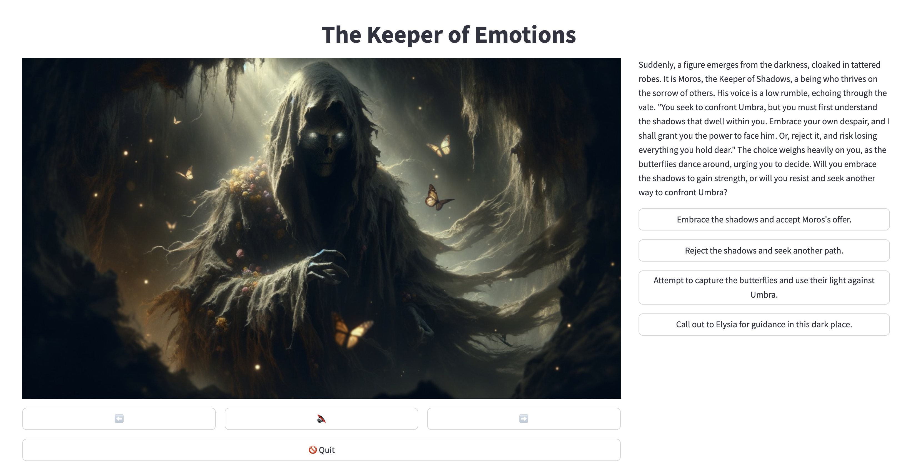

# 💭 Reveris - Interactive Story Generation Tool 💭

Reveris is a story generation tool that uses OpenAI's API to generate stories (with illustrations and TTS).
Users can influence the story's direction through interactive choices.


## Requirements

- Python 3.12.4
- OpenAI API key
- (Optional) DeepL API key for language translation.

## Setup

1. Install the required Python packages:
2. 
    ```bash
    pip install -r requirements.txt
    ```

3. Add your APIs keys in a `.env` file:
    ```
    OPENAI_KEY= Your OpenAI API key
    DEEPL_KEY= Your DeepL API key
    ```
    (The DeepL API enables translation into multiple languages.)

## Usage
1. Start streamlit:
   
    ```bash
    streamlit run app.py
    ```

## Cost
Generating a three-question story with the OpenAI API typically costs around $1 to $2.

## Rate limit
Generating a story could trigger rate limits if you're using the free tier of the OpenAI API. To avoid this, adjust batch sizes and introduce delays between queries. Here's how you may modify the settings in `openaiAPI.py`:
```python
API_MAX_BATCH_IMAGES = 1
API_MAX_BATCH_SPEECHES = 1
API_BATCH_DELAY = 60
API_REQUEST_DELAY = 20  # seconds
```
These settings help manage the API usage by limiting the number of requests and spacing them out to stay within the free tier's limits.

